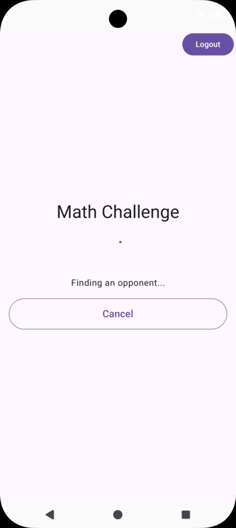

# 🧮 One Minute Math Challenge

A real-time multiplayer math game where players compete to solve math problems within a 60-second time limit. Built with modern Android architecture and real-time capabilities.

## ✨ Features

- 🎮 Real-time multiplayer gameplay
- 🔐 User authentication
- ⏱️ 60-second timed matches
- 📊 Live score tracking
- 🏆 Global leaderboard
- 🎯 Instant result feedback

## 🏗️ Architecture & Technical Stack

### UI & Presentation
- Jetpack Compose
- Material3
- ViewModel + StateFlow
- Navigation Compose

### Dependency Injection
- Hilt (Android DI)

### Data Management
- DataStore (Preferences)
- Retrofit (REST)
- WebSocket (Real-time)
- Repository Pattern

### Async & Concurrency
- Coroutines
- Flow/StateFlow

### Authentication
- Supabase Auth
- JWT Tokens

### Architecture Pattern
- MVVM
- Clean Architecture
- Use Cases

## 🚀 Getting Started

### Prerequisites
- Android Studio Arctic Fox or later
- JDK 17
- Android SDK 29+

### Setup
1. Clone the repository
```bash
git clone https://github.com/yourusername/math-test-android.git
```

2. Open the project in Android Studio

3. Create a `local.properties` file in the root directory and add your Supabase credentials:
```properties
SUPABASE_URL=your_supabase_url
SUPABASE_KEY=your_supabase_key
```

4. Build and run the project

## 🎮 Game Flow

1. **Authentication**
   - Sign up or log in using email/password
   - Secure token management with Supabase

2. **Main Menu**
   - Start game
   - View leaderboard
   - Logout option

3. **Gameplay**
   - Match with another player
   - 60-second timer
   - Solve math problems
   - Real-time score updates

4. **Results**
   - Final score comparison
   - Win/Loss/Draw status
   - Option to view leaderboard
   - Return to main menu

## 📱 Screenshots





## 🤝 Contributing

1. Fork the repository
2. Create your feature branch (`git checkout -b feature/AmazingFeature`)
3. Commit your changes (`git commit -m 'Add some AmazingFeature'`)
4. Push to the branch (`git push origin feature/AmazingFeature`)
5. Open a Pull Request

## 📄 License

This project is licensed under the MIT License - see the [LICENSE](LICENSE) file for details

## 👥 Authors

- Sarthak Gandhi - Initial work

## 🙏 Acknowledgments

- Thanks to all contributors
- Inspired by real-time math challenge games
- Built with modern Android development practices 
